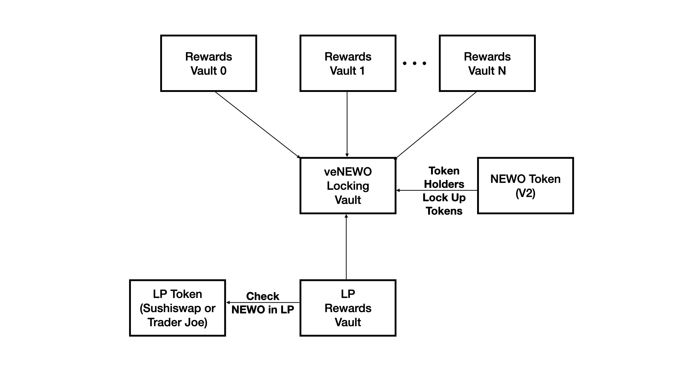
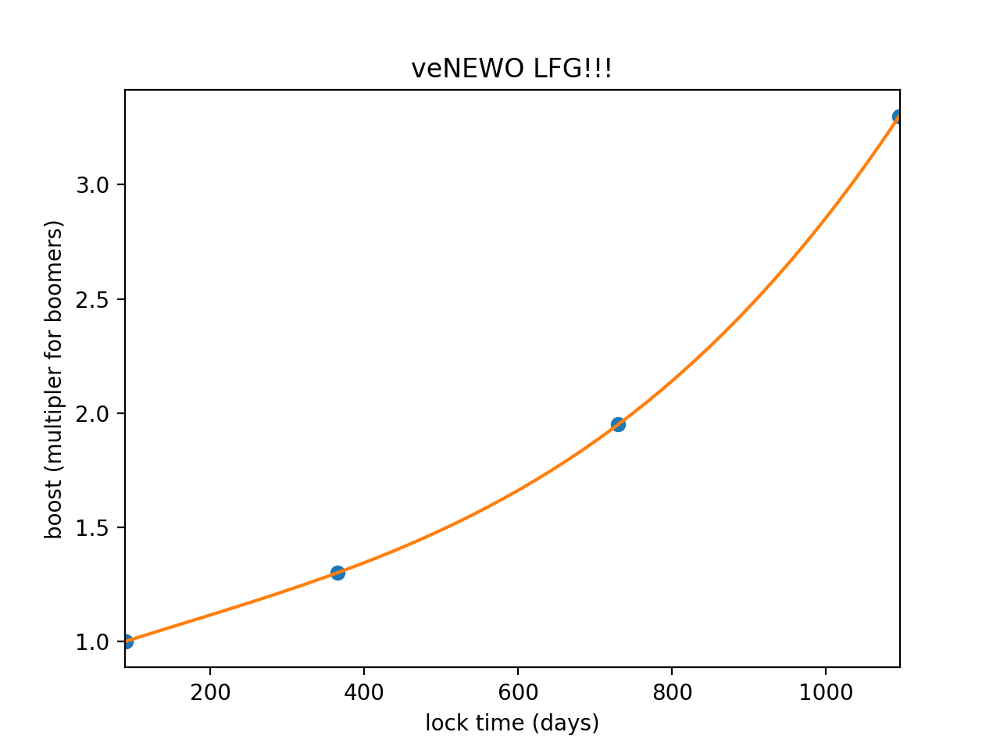

# New Order Voting Escrow (ve) Vault System

The code in this repository implements a Voting Escrow (ve) token for NewOrder.
They were created to replace the old staking rewards contracts, currently
being used by New Order to distribute rewards to their token holders in
favor of a system that rewards conviction.
<br><br>



The veNEWO system allows a token holder to lock up their ERC20 tokens for a
time period, and the token holder recieves a bonus amount of veNEWO depending
on the number of tokens and the duration for which they are locked.

The main goal is to create a ve token which works with other
reward distribution token contracts. This contract (veVault)
allows users to lock their ERC20 for a period of time. They receive
veTokens for doing so, which are not transferable.

Any number of reward distrubion contracts (Rewards.sol) can use the veNEWO held by an
account as the basis for the rewards accrued to the account.

In general the token holder has to notify each reward contract of the
token holder's veNEWO locked balance by calling notifyDeposit() on
each rewards contract. In the future, when the number of rewards vaults grows large;
the UX can be simplified by using a proxy contract
and locking tokens in the veNEWO.sol and calling notifyDeposit() on all known rewards contracts.

There is a variant of the rewards distribution contract for LP rewards
(LpRewards.sol) which implements special logic (see below).
If an LP token staker has a matching amount of locked NEWO in the veNEWO
vault to match the NEWO in the staked LP; the LpRewards vault will boost
the LP rewards by the ve Multiplier.

The contracts are discussed in further detail, below.


# Locking & Rewards Boost

veNEWO offers a bonus depending on how long an individual account decides to lock their tokens for.

The account locking tokens becomes a veNEWO Holder with their amount of veNEWO determined by the amount of veNEWO locked and the locking time period.

The minimum time to lock is 3 months (90 days) to earn a 1.0x multiplier.

The maximum bonus of 3.3x is achieved when tokens are locked for the maximum of 3 years (1095 days).


Amount of veNEWO = NEWO_locked * ve_multliper(x)

where x is the lockup time in days.

Then,

ve_multliper = x^3 * 1.54143856e-09 - x^2 * 7.48615904e-07 + x * 1.16304927e-03 + 9.00265646e-01





# Tokenized Vault Standard (EIP4626)

the veNEWO vault (veNEWO.sol) as well as the LP staking rewards vault (LpRewards.sol) implement EIP4626

https://eips.ethereum.org/EIPS/eip-4626

It didn't make sense to implement all functions - some revert upon calling.

For example, the transfer function reverts if called because these tokens are meant to be non-transferrable.


# Comparison to other ve token systems

## Constant veNEWO level

Rather than have ve rewards decay over time like some other ve reward models,
causing participants to have to re-lock occasionally in order to maintain
rewards (and burn transaction fees, accordingly) we instead encourage
longer locking periods with super-linear veNEWO rewards (see figure).

Therefore, the amount of veNEWO remains constant until it is unstaked.

## Forced Un-staking

Following a configurable grace period, anyone can forcibly unstake an account if the
locking period + grace period have elapsed. The account forcing the unstaking receives
some of the forcibly unstaked account's unclaimed rewards (another configurable parameter).

The system sets a minimum percentage to be received just after the grace period by the kicker. After this, each epoch an amount of percentage is summed to this percentage until a max penalty is reached. All parameters of this system can be changed, minimum, maximum, the value of each increase, the grace period and how long is each epoch.

The values can be set throught the following interface:
```
function changeGracePeriod(uint256 newGracePeriod)
function changeEpoch(uint256 newEpoch)
function changeMinPenalty(uint256 newMinPenalty)
function changeMaxPenalty(uint256 newMaxPenalty)
function changeStepPenalty(uint256 newStepPenalty)
```

Those values can be consulted throught the following interface:
```
function gracePeriod()
function penaltyPercentage()
function maxPenaltyPercentage()
function minPenaltyPercentage()
```

To force unstaking an address the following interface has to be used:
```
function withdraw(uint256 assets, address receiver, address owner)
```

Owner is the address being unstaked. To succefully unstake someone, the receiver be must the same address as the owner. Of course, the transaction sender is not the same address as the owner.

To figure out the max value of assets to be used in unstaking someone call the following function:
```
function assetBalanceOf(address account)
```

In resume:
```
address owner = <wallet address>;
veNewo.withdraw(veNewo.assetBalanceOf(owner), owner, owner);
```

## Controller for rewards contract
The vanilla rewards contract has all its front facing functionality for the user blocked now by the controller contract. The idea here is to enable this functionallity throught the controller to ensure:
1 - No user can use the rewards without agreeing with the terms and conditons (signing the legal new order declaration).
2 - Many rewards can be deployed and managed through this controller, without the need of looking for each reward contract and calling it individually.

To proper set it up the manager has to:
1 - Deploy the controller
2 - Deploy the rewards contracts
3 - Set the controller as a trustable controller in the reward
4 - Add the reward contract to the controller
```
reward.addTrustedController(controller.address);
controller.addRewardsContract(reward.address);
// Or if many reward contracts were deployed
controller.bulkAddRewardsContract([reward1.address, reward2.address, ...]);
```

To check if everything is properly setup, call rewardTrustableStatus(). It will return an array of all rewards contracts known by the controller that does not have the controller as trustable, if any.

Rewards contracts can be removed from the controller and the controller can be set to not trustable by the reward contract as well.

## Gracefully exiting

For an user to fully exit from the veNewo system, meaning collect all rewards and receive back all newo tokens. It first needs to collect all rewards and then unstake its newo. This is necessary since the rewards contract uses the balance of the veToken to grant rewards for the user. If the user has no veTokens on the moment it calls the reward contract it'll grant more zero rewards for it. So remember, first collect rewards and then unstake.

With the controller:
```
controller.getAllRewards(declaration);

veNewo.exit();
```

Before the controller:
```
// Collect all rewards
for (int i = 0; i < allRewards.lenght; i++) {
    allRewards[i].getRewards();
}

// Only after that exit
veNewo.exit()
```

## Re-locking

An address can re-lock its locked tokens anytime. Re-locking causes the amount of veNEWO
to be recalculated, and the new unlock time must be at the same time or in the future
when compared to the exisitng unlock time for the same address.

_Note: When re-locking only the current time and new lock period are taken into account
(consideration is not given for previous lock time). For example, a token holder locks their tokens for 1 year,
getting a multiplier of 1.3x on their locked NEWO. Let's say 364 days pass, and the token holder's multiplier remains at 1.3x that whole time.
On day 364 the token holder decides to re-lock all their NEWO for 3 months. Then, this token holder's new unlock date will be 3 months from the time of re-locking, and their multiplier will be 1x_

The re-locked address needs to notify reward vaults of the new unlock time and veNEWO amount.

## Rewards Interface

All users after locking Newo on the veVault need to notifyDeposit() in every rewards contracts to register itself for rewards (This is now done trougth notifyAllDeposit() on the controller). When calling notifyDeposit() an Account structure is created for that user in the respective rewards contract.

To tell if an user is registered for rewards on a rewards contract, you can call isRegistered(address user) on the reward contract. Returns true if the user is registered for rewards and false if is not.

You can also call depositUserStatus(address user) on the controller to check if user is registered on all rewards contracts known by the controller. It will return an array of rewards contract addresses where the user is not registered, if any.

# Contracts


This vault system was loosely inspired by the old StakingReward contract
by [synthetix](https://github.com/Synthetixio/synthetix) and by other
veTokens implementations like from Curve.

# Dependencies
requires Hardhat to be installed in order to run the test suite found in /test;
Installation instructions are found below.

# Instructions to run
First install npm dependecies
`npm install`

Create a .env file
`
echo "ETH_MAINFORK=<INSERT URL PROVIDER WITH YOUR KEYS>" >> .env
`

Install npm dependecies
```shell
npm install
```

Compile the contracts
```shell
npx hardhat compile
```

Run a hardhat node
```shell
npx hardhat node
```

Deploy the contracts
```shell
npx hardhat run --network localhost scripts/deploy.ts
```


# Deploy to eth-mainnet
Set .env file
```shell
echo "ETHEREUM_URL=<CHANGE TO YOUR PROVIDER WITH KEY>" >> .env
echo "PRIVATE_KEY=<CHANGE TO DEPLOYER PRIVATE KEY>" >> .env
```

Change the settings in scripts/ethDeploy.ts

Install npm dependecies
```shell
npm install
```

## Run the script
```shell
npx hardhat run --network ethereum scripts/ethDeploy.ts
```

# Etherscan verification

To try out Etherscan verification, you first need to deploy a contract to an Ethereum network that's supported by Etherscan, such as Ropsten.

In this project, copy the .env.example file to a file named .env, and then edit it to fill in the details. Enter your Etherscan API key, your Ropsten node URL (eg from Alchemy), and the private key of the account which will send the deployment transaction. With a valid .env file in place, first deploy your contract:

```shell
hardhat run --network ropsten scripts/deploy.ts
```

Then, copy the deployment address and paste it in to replace `DEPLOYED_CONTRACT_ADDRESS` in this command:

```shell
npx hardhat verify --network ropsten DEPLOYED_CONTRACT_ADDRESS "Hello, Hardhat!"
```
